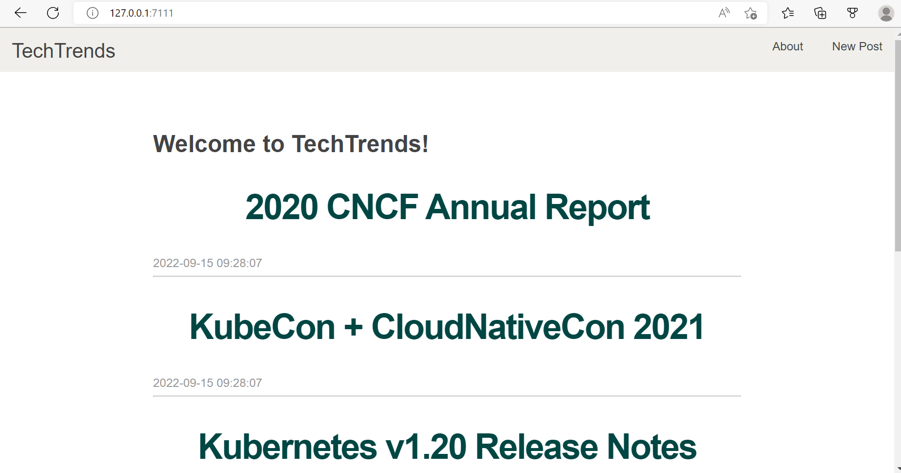

# Cloud Native Fundamentals Implementation
## TechTrends Project
### Project Overview
 TechTrends is an online website used as a news sharing platform, that enables consumers to access the latest news within the cloud-native ecosystem.
 In addition to accessing the available articles, readers are able to create new media articles and share them with the wider community. The implemetation involves to package and deploy the application to a Kubernetes platform.Project implementation includes Docker to package the application and automate the Continuous Integration process with GitHub Actions.Release process include Kubernetes declarative manifests, which were templated using Helm.ArgoCD is used to automate the Continuous Delivery process.

The web application is written using the Python Flask framework. It uses SQLite, a lightweight disk-based database to store the submitted articles.

## Tech Stack
### Web App
  - Python
  - Flask
  - SQLite
### Containerization & Virtualization
  - Docker
  - Vagrant
  - Virtual Box
### Continuous Integration & Continuous Delivery
  - GitHub Actions
  - ArgoCD
### Container Orchestration
  - Kubernetes

## Getting Started
### Build TechTrends Image
From the repository's root folder, build the app image:
```sh
$docker build -t anooshaprao/techtrends .
```

The build process will install all dependencies and start the SQLite DB, then expose port 3111 for this image.


### Run the Image
Run a container and test it locally:
```sh
docker run -d --name techtrends -p HOST_PORT:3111 anooshaprao/techtrends
```



